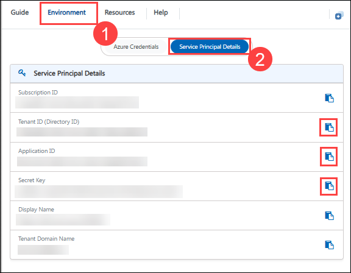
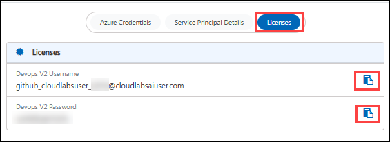
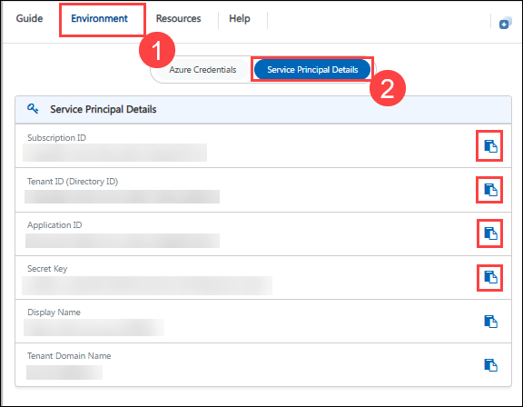

# Exercise 1: Continuous Integration and Continuous Deployment

### Estimated Duration: 120 Minutes

## Scenario

You are a DevOps engineer at Contoso Traders responsible for implementing a modern CI/CD pipeline for the company’s retail application. In this exercise, you will configure GitHub Actions workflows to automate application build, testing, and deployment to Azure services. You will also use GitHub Codespaces to update workflow files, manage Docker image publishing, and validate successful deployments through Azure-hosted resources. 

By the end of the exercise, you will have established an automated deployment process that improves development efficiency, consistency, and release reliability.

## Overview

In this exercise, you are going to set up the local infrastructure using dotnet. There are three parts of the application you will be working with: carts, products, and UI. You will deploy the infrastructure to cloud using GitHub Actions. You will also build automation in GitHub for updating and republishing our workflows when the code changes.

## Lab Objectives

In this lab, you will perform:

- Task 1: Access the lab files
- Task 2: Set up Local Infrastructure
- Task 3: Create the Project Repo
- Task 4: Build and push using GitHub Actions
- Task 5: Editing the GitHub Workflow File using Codespace

## Task 1: Access the lab files

In this task, you'll access and explore the code repository of the web app using Visual Studio Code. Visual Studio Code is a cross-platform, lightweight but powerful source code editor.

1. From the LabVM desktop, double-click on the **Visual Studio Code** desktop icon to open the application.

   

1. In **Visual Studio Code**, click on **File** **(1)** and select **Open Folder...** **(2)**.

   

1. In the **Open Folder** tab, navigate to the following path `C:\Workspaces\lab\aiw-devops-with-github-lab-files` **(1)** to open your local GitHub repository and click on **Select Folder (2)**.

   

1. You may receive a prompt: Do you trust the authors of the files in this folder? select the **checkbox** the box and click on **Yes, I trust the authors**.

   

1. You'll see the lab files in Visual Studio Code and explore the code files.

   

## Task 2: Set up Local Infrastructure

In this task, you will set up the local infrastructure using .NET. You'll be working with three Docker images: fabrikam-init, fabrikam-api, and fabrikam-web.

1. Open a **New Terminal** in the Visual Studio Code by selecting click on **ellipsis (...) (1)**, click on **Terminal (2)** and then on **New Terminal (3)**.

   

1. Click on the **drop-down** **(1)** button next to PowerShell and select **Command Prompt** **(2)** from the list. A new Command Prompt terminal will be opened.

   

1. Navigate to **Environment** **(1)**, click on **Service Principal Details** **(2)** to get the **Application Id (Client ID)**, **Secret Key (Client Secret)**, and **Tenant ID (Directory ID)**.

   

1. The **Application ID (Client ID)**, **Secret Key (Client Secret)**, and **Tenant ID** are already injected in the command mentioned below. Verify the values once and run it in the terminal.

   ```pwsh
   az login --service-principal -u <inject key="AppID" enableCopy="false" /> -p <inject key="AppSecret" enableCopy="false" /> --tenant <inject key="TenantID" enableCopy="false" />
   ```

   

1. Run the below-mentioned command to navigate to `ContosoTraders.Api.Products` folder.

   ```pwsh
   cd C:\Workspaces\lab\aiw-devops-with-github-lab-files\src\ContosoTraders.Api.Products
   ```

   

1. Run the below-mentioned command to set the secret path.

   ```
   dotnet user-secrets set "KeyVaultEndpoint" "https://contosotraderskv<inject key="DeploymentID" />.vault.azure.net/"
   ```

   

1. Run the below-mentioned command to build and host the carts locally.

   ```pwsh
   dotnet build
   dotnet run --no-build
   ```
   

   > **Note:** Please wait for 2 - 3 minutes for the build to complete.

1. Keep the terminal running. Open a new browser tab and try accessing the application using localhost port. You'll be able to see the output similar to the screenshot mentioned below.

   ```pwsh
   https://localhost:62300/swagger
   ```

   

   > **Note:** If you are not able to access the application, click on **Advanced** under Your connection isn't private.

   

   > **Note:** Then click on **Continue to localhost (unsafe)** to access the application.

     

1. Navigate back to **VS Code** and stop the terminal by typing **ctrl + C**. Run the below-mentioned command to navigate to `ContosoTraders.Api.Carts` folder.

   ```pwsh
   cd C:\Workspaces\lab\aiw-devops-with-github-lab-files\src\ContosoTraders.Api.Carts
   ```

   

1. Run the below-mentioned command to set the secret path.

   ```
   dotnet user-secrets set "KeyVaultEndpoint" "https://contosotraderskv<inject key="DeploymentID" />.vault.azure.net/"
   ```

   

1. Run the below-mentioned command to build and host the carts locally.

   ```pwsh
   dotnet build && dotnet run --no-build
   ```

   

   > **Note:** Please wait for 2 - 3 minutes for the build to complete.

1. Keep the terminal running. Open a new browser tab and try accessing the application using localhost port. You'll be able to see the output similar to the screenshot mentioned below.

   ```pwsh
   https://localhost:62400/swagger
   ```

   

1. Navigate back to **VS Code** and stop the terminal by typing **ctrl + C**.
   
1. From the search bar, search for **Command Prompt** and open the application.

   

1. Run the below-mentioned command to navigate to `ContosoTraders.Ui.Website` folder.

   ```pwsh
   cd C:\Workspaces\lab\aiw-devops-with-github-lab-files\src\ContosoTraders.Ui.Website
   ```

   

1. Run the below-mentioned command to install npm.

   ```pwsh
   npm ci
   ```
   

   

   > **Note:** Please wait until the installation completes. It will take around 10 - 15 minutes when you run npm install for the first time. In case the execution is stuck, please use **ctrl + C** to stop the execution and retry the step.

1. Now run the following command to run the UI of the application. This will automatically open a browser tab where you'll see the complete application running

   ```pwsh
   npm run start
   ```

   

   > **Note:** It can take 5 - 10 minutes when you execute the command for the first time. You can continue with the next task and check on this step later.

## Task 3: Create the Project Repo

In this task, access the GitHub Enterprise account), create a new repository to store the infrastructure, and use git to add the lab files to it.

1. In a new browser tab, open `https://www.github.com/login`. From **Environment** page, navigate to **Licenses** tab and **Copy** the credentials. Use the same username and password to login into GitHub.

   

1. For **Device Verification Code**, use the same credentials as in the previous step, open `http://outlook.office.com/` in a private window, and enter the same username and password used for GitHub Account login. Copy the verification code and Paste code it in Device verification.

   

   >**Note:** If you receive the prompt to enable 2FA then click on **Remind me tomorrow**

   

1. In the upper-right corner, expand the user **drop-down menu** **(1)** and select **Your repositories** **(2)**.

   

1. Next to the search criteria, locate and select the **New** button.

   

1. On the **Create a new repository** screen, name the repository **aiw-devops-with-github-lab-files (1)**, select **Public (2)** and click on **Create repository (3)** button.

   

   > **Note:** If you observe any repository existing with the same name, please make sure you delete the Repo and create a new one. Please follow the steps given below. Else, skip to step 6.
      
      i. In the upper-right corner, expand the user **drop-down menu** **(1)** and select **Your repositories** **(2)**.
      
      
      
      ii. Using the search bar, search for `aiw-devops-with-github-lab-files` **(1)** and select to open it **(2)**.
      
      
      
      iii. From the GitHub repository, click on the **Settings** tab.
      
      
      
      iv. In the settings page, scroll to the bottom of the page and select **Delete this repository**.
      
      
      
      v. On the pop-up, select **I want to delete this repository**.

      

      vi. Then, select **I have read and understand these effects**.

      

      vii. Copy the repository name **(1)** and paste it in the text box **(2)**.  Then click on **Delete this repository (3)**.

      

1. On the **Quick setup** screen, copy the **HTTPS** GitHub URL for your new repository, and **save it** in a notepad for future use.

   

1. From the GitHub username, note down the **Unique-ID** present in the Username. You'll use this value in upcoming steps.

   

1. Navigate back to the **Visual Studio Code** application in which the terminal is already open.

   

1. In the terminal, click on the **drop-down** button and select **PowerShell** to open a fresh PowerShell terminal tab.

   

1. In the Visual Studio Code, run the below commands in the terminal to set your **username** and **email**, which Git uses for commits. **Make sure to replace the GitHub account email and username.** 

   ```pwsh
   cd C:\Workspaces\lab\aiw-devops-with-github-lab-files
   git config --global user.email "you@example.com"
   git config --global user.name "Your UserName"
   ```

   

   Run the below-mentioned command in the terminal. Make sure to replace your_github_repository-url with the value you copied in step 6 and Unique-ID in step 7.

   **Note:** This step is done to Initialize the folder as a git repository, commit, and submit contents to the remote GitHub branch “main” in the lab files repository created in Step 1.

   ```pwsh
   git init
   git add .
   git commit -m "Initial commit"
   git branch -M main
   git remote add origin<Unique-ID> <your_github_repository-url>
   git push -u origin<Unique-ID> main
   ```

   - If you are asked to authenticate your GitHub account. Select **Sign in with your browser** and you might be prompted with a pop-up window to authorize Git Credential Manager. Click on **Authorize git-ecosystem** to provide access.
   
     

     

   - After you are prompted with the message **Authorization Succeeded**, close the tab and continue with the next task.

     > **Note:** If you get any error like push is blocked as secret is not allowed, do these steps.

     

   -  Navigate up in the error message and click on the given link for ( To Push, remove secret from commits or follow this URL to allow the secret).

      

   - Select **It's used in tests** and click on the **Allow me to expose this secret**.

     

   - Navigate back to the **Visual Studio Code** application, run the command again.

     

## Task 4: Build and push using GitHub Actions

In this task, you will build automation in GitHub for updating and republishing our Docker images when the code changes. You will create a workflow file using the GitHub interface and its GitHub Actions workflow editor. This will get you familiar with how to create and edit an action through the GitHub website.

1. From the Azure Portal Dashboard, click on **Resource groups** from the navigation panel to see the resource groups.

   

1. Select **contoso-traders-<inject key="DeploymentID" enableCopy="false" />** resource group from the list.

   

1. Select **productsdb** SQL database from the list of resources.

   

1. Under Settings side blade, select **Connection strings** **(1)** under Setting and copy the **ADO.NET (SQL authentication)** **(2)** connection string from 
   ADO.NET tab.

   

1. In your GitHub lab files repository, select the **Settings** tab from the lab files repository.

   

1. Under **Security**, expand **Secrets and variables** **(1)** by clicking the drop-down, then select **Actions** **(2)** from the left navigation bar, and click the **New repository secret** **(3)** button.

   

1. Under **Actions secrets/ New secret** page, enter the below mentioned details and Click on **Add secret** **(3)**.

   - **Name:** Enter **SQL_PASSWORD** **(1)**
   - **Secret:** Paste the **ADO.NET (SQL authentication)** **(2)** which you copied in previous step.
     > **Note:** Replace `{your_password}` with the ODL User Azure Password.
     > 1. Navigate to Home screen on your Virtual machine and click on AzureCreds file and copy the AzurePassword value with `{your_password}` value.
     > 

     

1. Navigate to **Environment** **(1)**, click on **Service Principal Details** **(2)** and copy the **Subscription ID**, **Tenant Id (Directory ID)**, **Application Id (Client Id)** and **Secret Key (Client Secret)**.

   

   - Replace the values that you copied in below Json. You will be using them in this step.

      ```json
      {
      "clientId": "zzzzzzzz-zzzz-zzzz-zzzz-zzzzzzzzzzzz",
      "clientSecret": "zzzzzzzzzzzzzzzzzzzzzzzzzzzzzzzzzzzzzzzz",
      "tenantId": "zzzzzzzz-zzzz-zzzz-zzzz-zzzzzzzzzzzz",
      "subscriptionId": "zzzzzzzz-zzzz-zzzz-zzzz-zzzzzzzzzzzz"
      }
      ```

1. Select the **New repository secret** button. Under the **Actions secrets/ New secret** page, enter the below-mentioned details and click on **Add secret** **(3)**.

   - **Name:** Enter **SERVICEPRINCIPAL** **(1)**
   - **Secret:** Paste the service principal details in json format **(2)**

     

1. Select the **New repository secret** button. Under the **Actions secrets/ New secret** page, enter the below-mentioned details and click on **Add secret** **(3)**.

   - **Name:** Enter **ENVIRONMENT** **(1)**
   - **Secret:** **<inject key="DeploymentID" enableCopy="false" />** **(2)**

     

1. From your GitHub repository, select **Actions** **(1)** tab. Select the **contoso-traders-app-deployment** **(2)** workflow from the side blade, Click on the **drop-down** **(3)** next to **Run workflow** button, and select **Run workflow** **(4)**.

    

   > **Note:** If you can’t find the **contoso-traders-app-deployment** workflow, try closing and reopening Visual Studio Code to perform step 10 of Task 3 again. 

1. Navigate back to the Actions tab and select the **contoso-traders-app-deployment** workflow. This workflow builds the Docker image, which is pushed to the container registry. The same image is pushed to the Azure container application.

    

    

    >**Note:** If the workflow **fails** due to **npm install** job, follow from step 13 - step 15. Otherwise, continue from step 16.

1. From the GitHub browser tab, follow the steps given below and click on **Create codespace on main** **(3)**.

   - Click on **Code** **(1)**,
   - Select the **Codespace** **(2)** tab

     

1. Run the below-mentioned commands in the **Terminal**. You'll set the node version to node 14.

      ```pwsh
      cd src
      cd ContosoTraders.Ui.Website
      nvm install 14
      nvm use 14
      npm i
      git add .
      git commit -m "updated node version"
      git push
      ```

1. From your GitHub repository, select **Actions** **(1)** tab. You'll see an Action named **Updated node version** **(2)** executing. Please wait until the execution completes

    

    

1. Navigate to the Azure Portal, click on **Resource groups** from the Navigate panel to see the resource groups.

    

1. Select **contoso-traders-<inject key="DeploymentID" enableCopy="false" />** resource group from the list.

    

1. Search for **ui2 (1)** and select **contosotradersui2<inject key="DeploymentID" enableCopy="false" /> (2)** storage account from the list.

    

1. On the storage account page, navigate to **Static website** **(1)** under **Data Management**, enable it by selecting **Enabled** **(2)**, enter **index.html** **(3)** as the index document name, and click **Save** **(4)** to apply the changes.

     

1. Navigate back to the **contoso-traders-cdn<inject key="DeploymentID" enableCopy="false" /> (1)** resource group and select **contoso-traders-cdn<inject key="DeploymentID" enableCopy="false" /> (2)** endpoint from the list of resources.

    

1. Copy the **Endpoint hostname** for **contoso-traders-ui2<inject key="DeploymentID" enableCopy="false" />** by clicking the **Copy** icon next to it.

    

1. Open a new browser tab, paste the **Endpoint hostname**, and verify that the **Contoso Traders** app loads successfully.

    

## Task 5: Editing the GitHub Workflow File using Codespace

The last task automated building and updating only one of the Docker images. In this task, we will update the workflow file with a more appropriate workflow for the structure of our repository. This task will end with a file named `docker-publish.yml` that will rebuild and publish Docker images as their respective code is updated.

1. From the GitHub browser tab, follow the steps given below and click on **Create codespace on main** **(3)**.

   - Click on **Code** **(1)**
   - Select the **Codespace** **(2)** tab

     
 
     > **Note:** In case you had created a codespace in the previous task. Click on the **+** button to create a new codespace.

2. You'll be redirected to a new codespace tab in the browser. Please wait until the codespace is configured.

   

3. In the Visual Studio Code tab, select **Open** to allow the GitHub Codespaces extension to open the URL.

   

   > **Note:** In case you recieve a pop-up, click on **Allow** then click on **Continue** and then **Open** to authorize Github login.

   > **Note:** In case the Visual Studio Code pop-up does not show up, you can continue with codespaces in the web page.

4. From the explorer side blade, navigate to **.github (1)** > **workflows** **(2)** and select **contoso-traders-provisioning-deployment.yml** **(3)** file.

    

5. Remove the commands from lines 7 to 14 from the workflow file and save this file by using **Ctrl+S**.

    

6. Using the terminal from Codespace, run the following commands to commit this change to your repo and to push the change to GitHub.

    ```pwsh
    git add .
    git commit -m "Updating app deployment"
    git push
    ```

    

   > **Note:** This will update the workflow and will **not** run the "Update the ... Docker image" jobs.

7. Navigate back to the GitHub browser, select the **Actions** **(1)** tab, and review the **workflow** **(2)** created automatically for the changes made.

    

    

## Summary

In this exercise, you hosted the application locally, deployed the application to Azure using GitHub Actions, and explored Codespace.

### You have successfully completed the lab. Click on **Next >>** to proceed with the next exercise.


