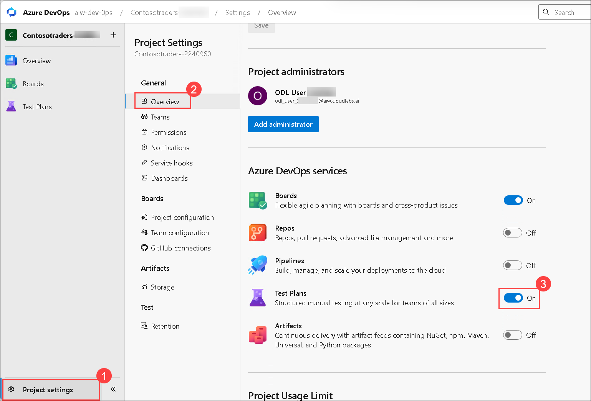
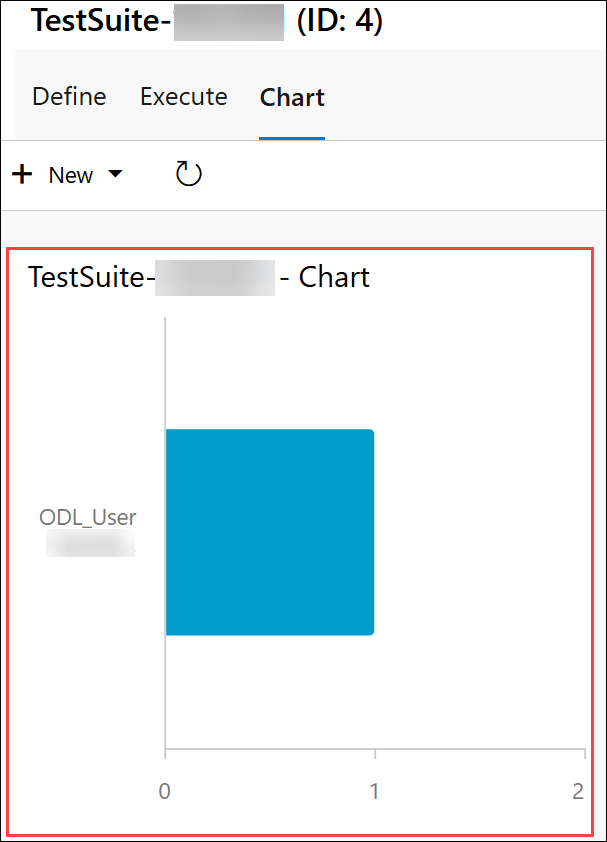

# Exercise 2: Azure Boards and Test Plans

### Estimated Duration: 120 Minutes

## Scenario

You are part of the DevOps team at Contoso Traders, where efficient project tracking and quality assurance are critical to delivering reliable application updates. In this exercise, you will connect Azure Boards with GitHub to streamline work item management and improve collaboration between developers and testers. 

You will also configure Azure Test Plans to create, execute, and monitor manual test cases, ensuring application features are validated before deployment.

## Overview

In this exercise, you'll explore Azure boards and Azure test plans. Azure Boards provides software development teams with the interactive and customizable tools they need to manage their software projects. Azure Test Plans provides rich and powerful tools that everyone in the team can use to drive quality and collaboration throughout the development process. The easy-to-use, browser-based test management solution provides all the capabilities required for planned manual testing.

## Lab Objectives

In this lab, you will perform:

- Task 1: Connect Azure Board with GitHub
- Task 2: Link GitHub Pull requests to Boards items
- Task 3: Configure Azure Test plan

## Task 1: Connect Azure Board with GitHub

In this task, you will connect your Azure DevOps project's board to your GitHub repository using the Azure Boards app for GitHub to support the integration between Azure Boards and GitHub. This app is free for both public and private repositories. You'll also explore work items.

1. In your browser, open a new tab and navigate to the GitHub Marketplace using the following URL:

   ```
   https://github.com/marketplace/azure-boards
   ```

   

1. Scroll to the bottom of the page and select **Install it for Free**.

   

1. In review, your order page, enter the billing information and click on **Save billing information**.

   > **Note:** If the **Install it for free** button is greyed out  with the message **You’ve already purchased this on all of your GitHub accounts**, this indicates Azure Boards integration is already used in your account. Follow the steps below, and please proceed from step number 4.

     - Scroll to the top of the Azure Boards Marketplace page and click on the **ellipsis (...) (1)** and select the **github user (2)**.

         

     - On the **Edit your plan** page, click on **grant this app access**.

         

     - On the **Install & Authorize Azure Boards** page, choose **Only select repositories**, click **Select repositories**, and select the repository you have created earlier. Once it appears in the list, check the permissions, then click **Install & Authorize** to finish the setup.

         

   - Copy the Azure DevOps URL and open it in an **In-Private** browser window. Select the ODL **Email** <inject key="AzureAdUserEmail"></inject>, then enter the password and click on **Sign in**.

        

1. On the next page, select **Complete order and begin installation**.

   

   >**Note:** If Azure Boards is already installed, follow the steps below to uninstall it.

   - Click on the **ellipsis (...) (1)** from top right corner and select **Configure account access (2)**

     
   
   - On the Applications pane in the Installed Github Apps tab, click on **Configure** for Azure Boards.

     

   - Scroll down to the **Danger zone** section and click on **Uninstall** to remove **Azure Boards** from your GitHub account.

     

   - On the GitHub.com pop-up, simply click **OK** to proceed.

     

   - Now, go back to `https://github.com/marketplace/azure-boards` and click **Install** under the **Plans and pricing** section.

1. On the **Install & Authorize Azure Boards** page, choose **Only select repositories (1)**, click **Select repositories (2)**, and select the repository you have created earlier. Once it appears in the list, check the permissions, then click **Install & Authorize (3)** to finish the setup.

   

1. On the **Setup your Azure Boards project** page, select the **aiw-devops** **(1)** Azure DevOps organization, enter or select the project name **Contosotraders-<inject key="DeploymentID" enableCopy="false" />** **(2)**, and then click **Continue** **(3)** to proceed.

   

## Task 2: Link GitHub Pull requests to Boards items

In this task, you'll make changes in GitHub link a PR to Azure boards using syntax, and monitor the work item.

1. In the Azure Boards tab, click on **+ New Item** **(1)**, provide **Update carts** **(2)** as a description and create a new work item by hitting **enter**.

   

1. After creating a work item, please note down the Work item ID, which will be used in the further steps.

   

1. Select the **Code** **(1)** tab in your GitHub repository, navigate to **aiw-devops-with-github-lab-files/.github/workflows/** **(2)** and select **contoso-traders-provisioning-deployment-old.yml** **(3)** file.

   

1. Copy `#test azure boards` code and paste it into line number 1 of the file. Make sure there are no indentation errors.

   

1. Click on **Commit Changes...** **(1)**, provide the details mentioned below and click on **Propose changes** **(5)**.

   - Provide `workitem ID Updated` **(2)** as title. Make sure to provide the same **Work item ID** that was created in the earlier step in Azure DevOps.
   - Select **Create a new branch for this commit and start a pull request** **(3)** and name the new branch as **Update carts** **(4)**.

     

1. On the Open pull request tab, click on **Create pull request**.

   

1. Navigate to **Azure Boards**, click on the **ellipsis** **(...)**, and then **Open** **(1)** the work item that was created in the earlier step.

   

1. Under the **Development** page, select the **Add link**.

   

1. On the **Add Link** window, select your **GitHub Repository** **(2)**, choose **GitHub Pull Request** **(1)** as the link type, select the specific **GitHub pull request** **(3)**, and then click on **Add link** **(4)** to complete the process.

   

1. Navigate back to the GitHub browser tab and select the **Pull requests** tab.

   

1. Open the PR created from **updated carts** branch and select **Merge pull request**.

   

1. Update the description as **AB#{workitemID} updated (1)** and select **confirm merge (2)**.

   

1. Navigate back Azure Boards tab and notice that the **work item** has been marked as **done**.

   
   > **Note:** The work item may take a little while to be marked to **Done**. You can proceed to the next task and exercise and come back and check once you have completed the lab.

## Task 3: Configure Azure Test plan

In this task, you'll set up an Azure test plan and perform manual testing for the application.

1. From the Azure DevOps tab, select **Test plans (1)** from the side blade. From the Test plans tab, click on **+ New Test Plan (2)**.

   


    >**Note:** If you are unable to see **Test plans**, follow the steps below:
   
    - Click on **Project Settings (1)**, then select **Overview (2)**, and turn the **Test plans (3)** option to **On**.

      
    
    >**Note:** If you are unable to See **+ New Test Plan** option then please follow below steps:

    - From the top select **Azure DevOps** then click on **Organization settings (2)**.

      

    - Select **Users (1)** under general, then select **tree dots (2)** of odl user and select **Change access level (3)**.

      

    - Then select access level **Basic + Test Plans (1)** and click on **Save (2)**. and reperform previous step.

      

1. In the New Test Plan tab, provide the following details and click on **Create** **(4)**.

   - Name: **TestPlan-<inject key="DeploymentID" enableCopy="false" />** **(1)**
   - Area Path: **contosotraders-<inject key="DeploymentID" enableCopy="false" />** **(2)**
   - Iteration: Leave it to **default** **(3)**

     

1. From contosotraders-<inject key="DeploymentID" enableCopy="false" /> test plan tab, select **More options (...)** **(1)** button, hover over **New Suite** **(2)**, and select **Static suite** **(3)**.

   

1. Create a new suite as **TestSuite-<inject key="DeploymentID" enableCopy="false" />**.

   

1. From the Test plans tab, click on **New Test Case**.

   

1. In the New Test Case pop-up, provide the following details and click on **Save & Close (4)**

   - Name: **Validate the web app (1)**
   - Actions: Select **Access the Contoso Traders app (2)** and Expected result: **Succeeded (3)**

     

1. From the Test plans tab, navigate to **Execute** **(1)** tab, select the **validate the web app** **(2)** test point and click on **Run for web application** **(3)**.

   

1. A web-based runner will be opened. Manual testing of the web app can be performed. Keep this page open, we will use the runner in the upcoming steps.

   

1. Navigate to **Azure Portal**, and click on **Resource groups** from the Navigate panel to see the resource groups.

   

1. Select **contoso-traders-<inject key="DeploymentID" enableCopy="false" />** resource group from the list.

   

1. Select **contoso-traders-cdn<inject key="DeploymentID" enableCopy="false" /> (2)** endpoint from the list of resources.

    

1. Copy the **Endpoint hostname** for **contoso-traders-ui2<inject key="DeploymentID" enableCopy="false" />** by clicking the **Copy** icon next to it and paste it in a new tab.

    

1. Verify the availability of the web app. Simultaneously using the runner page, perform the testing by marking the steps according to the availability of the web app and click on **Save & close**.

   

   

1. From the execute tab, verify the **outcome** of the manual testing. The outcome will be in a **Passed** state if the web app worked as expected and vice versa.

   

1. Navigate to **Chart** **(1)**, click on **+ New** **(2)** and select **+ New test case chart** **(3)**.

   

1. In the **Configure chart** pop-up, select **Bar** **(1)** as the chart type, choose **Activated By** **(2)** for the *Group by* option, and then click on **OK** **(3)** to create the chart.

   

1. You'll be able to visualize the chart. You can explore more by making changes in the chart and by running multiple test cycles.

   

## Summary

In this exercise, you explored the features of Azure boards and configured Azure Test plans for the application.

### You have successfully completed the lab. Click on **Next >>** to proceed with the next exercise.


