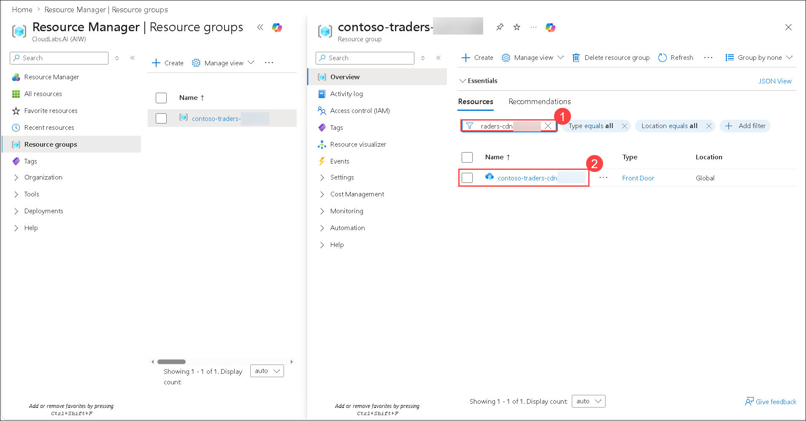
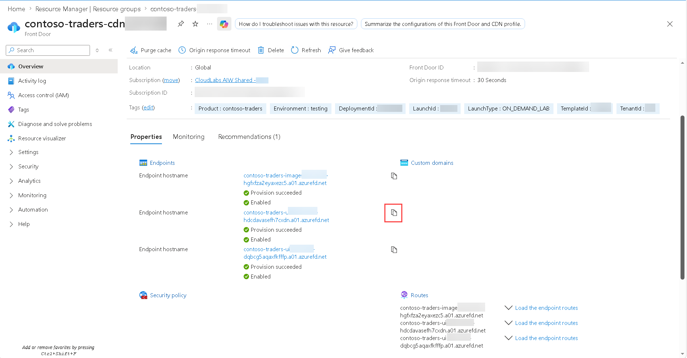
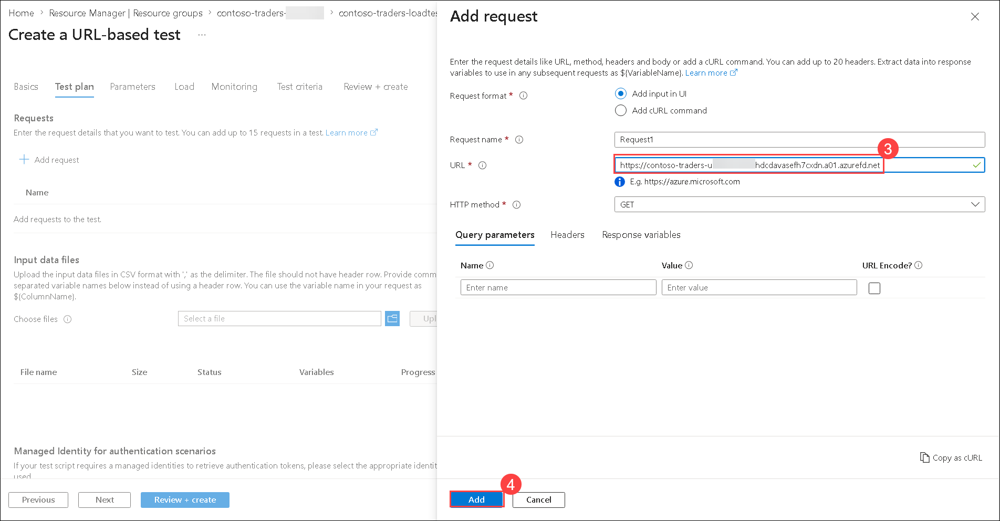
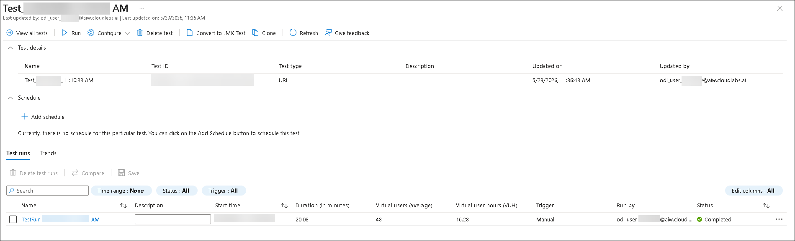

# Exercise 4: Monitoring and Load Testing

### Estimated Duration: 120 minutes

## Scenario

You are part of the Site Reliability Engineering (SRE) team at Contoso Traders, responsible for ensuring application performance, availability, and resilience in the cloud environment. In this exercise, you will monitor application health and usage metrics using Azure Application Insights, perform load testing to evaluate scalability under simulated traffic, and explore Azure Chaos Studio to test how the application responds to real-world failures. 

These activities help validate system reliability, improve performance monitoring, and strengthen operational resilience.

## Overview

In this exercise, we will add monitoring and logging to gain insight on the application's usage in the cloud. Then create Azure load testing, which is a fully managed load-testing service that enables you to generate high-scale loads. The service simulates traffic for your applications, regardless of where they're hosted. Developers, testers, and quality assurance (QA) engineers can use it to optimise application performance, scalability, or capacity. We will also explore Azure Chaos Studio, which helps you measure, understand, and improve your cloud application and service resilience.

## Lab Objectives

In this lab, you will perform:

- Task 1: Monitoring using Application Insights
- Task 2: Set up Load Testing
- Task 3: Explore Chaos Studio

## Task 1: Monitoring using Application Insights

This task focuses on using Azure Application Insights to monitor the health and performance of the Contoso Traders application. You will review various monitoring metrics over a chosen time range.

1. In the Azure Portal, navigate to **contoso-traders-<inject key="Deploymentid" enableCopy="false" />** **(1)** resource group and select the **Application Insights** resource with the name **contoso-traders-ai<inject key="Deploymentid" />** **(2)**.

   

1. From the **Overview** of **contoso-traders-ai<inject key="Deploymentid"  enableCopy="false" />** Application Insights resource, you can set the **Show data for last** as per your requirement of monitoring insights.

   

1. In the first graph, you can see the number of **Failed requests** for the Application access.

   

1. In the next graph, you can see the average **Server response time**.

   

1. In the next graph, you can see the number of **Server requests**.

   

1. In the last graph, you can see the average **Availability**.

   

## Task 2: Set up Load Testing

In this task, you'll create an Azure Load Testing instance and run a test using a JMeter file.

1. In the Azure Portal, navigate to **contoso-traders-<inject key="Deploymentid" enableCopy="false" />** resource group and select the **Front Door** resource with the name **contoso-traders-cdn<inject key="Deploymentid" />**.

   

1. From the overview of **contoso-traders-cdn<inject key="Deploymentid" enableCopy="false" />** CDN, copy the **Endpoint hostname** and paste it into the notepad for later use in the task.

   

1. In the Azure Portal, navigate to **contoso-traders-<inject key="Deploymentid" enableCopy="false" />** **(1)** resource group and select the **Azure Load Testing** resource with the name **contoso-traders-loadtest<inject key="Deploymentid" />** **(2)**.

   

1. On the left hand side pane, select **Tests** **(1)** under **Tests** section and click on **+ Create** **(2)** and choose **Create a URL-based test** **(3)**.

   

1. On the **Create a URL-based test** page, under the **Basics** tab, leave all fields as default and click on **Next** to continue.

1. On the **Test plan** **(1)** page, click on **+ Add request** **(2)**, paste the **Endpoint URL** into the **URL** field **(3)**, leave all other settings as default, and then click **Add** **(4)**.

   

   >**Note**: Include "**https://**" at the starting of the URL, and paste the **Endpoint URL**.

   

1. Click on **Review + create** and click on **Create**.

1. The test run will start running, and once the test run is completed, you will be able to see **Client-side metrics**. Explore the given metrics output.

   >**Note**: It will take 20 minutes for the test to complete.
   
   

   

   **Note**: In case the test fails due to `The test was stopped due to a high error rate. Check your script and try again. In case the issue persists, raise a ticket with a support error`. This is expected as sometimes the load on the application exceeds the defined throughput.

>**Congratulations** on completing the Task! Now, it's time to validate it. Here are the steps:
 
> - Hit the Validate button for the corresponding task. If you receive a success message, you have successfully validated the lab. 
> - If not, carefully read the error message and retry the step, following the instructions in the lab guide.
> - If you need any assistance, please contact us at cloudlabs-support@spektrasystems.com.

   <validation step="d553ecad-c385-4148-ba65-fbce5cb985ad" />

## Task 3: Explore Chaos Studio

In this task, you will add **Targets** and create an **Experiment** on **Azure Chaos Studio** to check the resilience of the web application that we created by adding real faults and observe how our applications respond to real-world disruptions.

1. In the Azure Portal search for **Chaos Studio (1)** and then click on it from the search results **(2)**.

   

1. In the **Azure Chaos Studio**, select **Targets (1)** in the left menu from the **Experiments management** dropdown. From the drop-down menu, select **contoso-traders-<inject key="DeploymentID" enableCopy="false" />** **(2)** resource group.

   

1. Click on the **contoso-traders-aks<inject key="DeploymentID" enableCopy="false" />** **(1)** Kubernetes service instance, then from the **Enable targets** **(2)** drop-down, select **Enable service-direct targets (All resources)** **(3)**.

   

1. Click on **Review + Enable**.

   

1. Then click on **Enable** to enable service direct targets.

   

1. Wait for the deployment to be completed.

1. In the Azure Portal search for **Chaos Studio** **(1)** and then click on it from the search results **(2)**.

   

1. Once the target is enabled, select **Experiments** **(1)** from the Experiments management dropdown on the left, click **+ Create** **(2)** drop-down, and select **New experiment** **(3)** .

   

1. On the **Create an experiment** page, under **Basics** tab provide the following values and select **Next: Permissions >** **(4)**.

   - Subscription: Select the default subscription **(1)**
   - Resource group: **contoso-traders-<inject key="DeploymentID" enableCopy="false" />** **(2)**
   - Name: **contoso-chaos-<inject key="DeploymentID" enableCopy="false" />** **(3)**
   - Region: Leave it to default

     

1. On the **Permissions** tab, select **Assign experiment permission manually (1)** for the Experiment permissions option, then click **Next: Experiment designer > (2)** to continue.

   

1. On the **Experiment designer** tab, select **+ Add action (1)** and choose **Add fault (2)**.

   

1. On the **Add fault** page, under **Faults details** tab, provide the following details and select **Next: Target resources > (3)**.

   - Faults: **AKS Chaos Mesh Pod Chaos (deprecated)** **(1)**
   - Duration (minutes): **5** **(2)**
   - jsonSpec: Leave it to the default 

      

1. On the **Target resources** tab, select the **Manually select from a list** **(1)** under **Select target resources**, select the **contoso-traders-aks<inject key="DeploymentID" enableCopy="false" />** **(2)** resource, and click **Add** **(3)**.

   

1. Click on **Review + create**.

   

1. On the **Review + create** page, review the configuration and click on **Create**.

   

1. Navigate back to the **contoso-traders-aks<inject key="DeploymentID" enableCopy="false" />** Kubernetes service and select **Access control (IAM) (1)** from the left navigation pane, click on **+ Add (2)** and select **Add role assignment (3)**.

   

1. In the **Add role assignment** page, under **Role** tab, select **Privileged administrator roles (1)**. Select **Owner (2)** in it and then **Next (3)**.

   

1. Next, on the **Members** tab, select **Managed identity** **(1)** for **Assign access to**, then click on **+ Select members** **(2)**. In the **Select managed identities** pane, choose **Chaos Experiment** **(3)**, select the experiment **contoso-chaos-<inject key="DeploymentID" enableCopy="false" />** **(4)**, click **Select** **(5)**, and then click **Next** **(6)** to proceed.

   

1. Next on the **Conditions** tab, select **What user can do** as **Allow user to assign all roles (highly privileged)** **(1)** and click on **Review + assign** **(2)**.

   

1. Click on **Review + assign**.

   

1. On the Azure portal, navigate back to the Chaos experiment you created, **contoso-chaos-<inject key="DeploymentID" enableCopy="false" />**, and click on **Start** to begin the experiment.

   

1. Select **Ok** for **Start this experiment** pop-up.

   

1. Once the experiment status is **Success** click on **Details** to view the run preview.

   

1. On the **Details** preview page, review the **Completed Status** of the run to verify its outcome and view all relevant details.

   

>**Congratulations** on completing the Task! Now, it's time to validate it. Here are the steps:
 
> - Hit the Validate button for the corresponding task. If you receive a success message, you have successfully validated the lab. 
> - If not, carefully read the error message and retry the step, following the instructions in the lab guide.
> - If you need any assistance, please contact us at cloudlabs-support@spektrasystems.com.

   <validation step="7042c8dd-d5f9-4300-92a9-6d1e0ae9a1c4" />
   
## Summary

In this exercise, you explored monitoring using Application Insights. You also configured Load testing and Chaos experiments for the application.

### You have successfully completed the lab!

Congratulations on completing **Devops with GitHub**. 

This lab offered a practical experience and covered:

   - Setting up infrastructure and CI/CD pipelines using GitHub and Azure.

   - Integrating GitHub with Azure Boards and Test Plans for project tracking.

   - Enabling GitHub security features such as CodeQL, Dependabot, and secret scanning.

   - Monitoring applications with Azure Application Insights.

   - Running load tests to validate performance and scalability.

   - Using Azure Chaos Studio to test application resilience.
