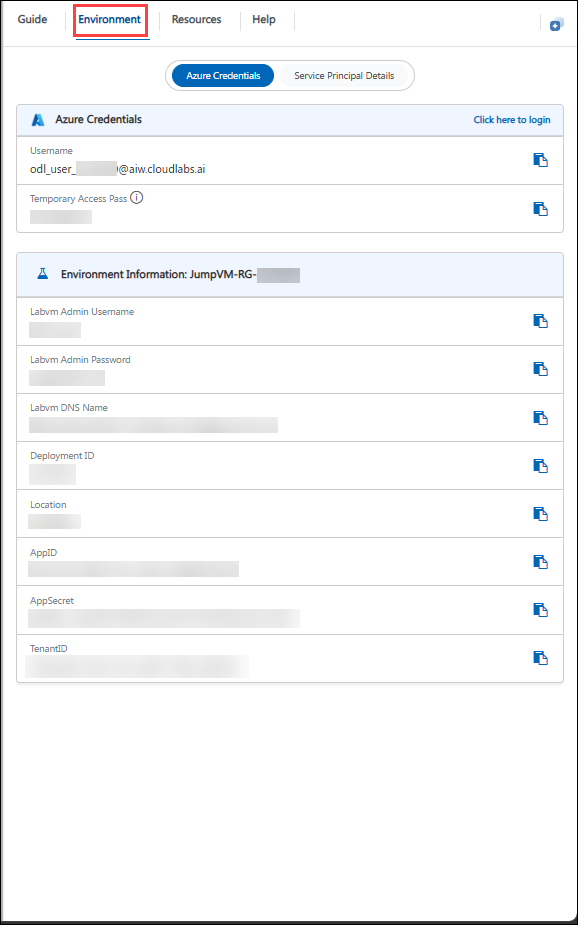

# DevOps with GitHub 

### Overall Estimated Duration: 8 Hours

## Lab Scenario

A retail company, Contoso Traders, wants to modernize its application delivery process by implementing DevOps practices using GitHub and Azure services. The development team needs to build and deploy .NET-based microservices, automate CI/CD pipelines with GitHub Actions, and integrate Azure Boards for project tracking and testing. To improve application security and reliability, the organization also plans to enable GitHub Advanced Security features, perform load testing, monitor application performance using Application Insights, and simulate failures using Azure Chaos Studio. 

This lab helps participants gain hands-on experience in automating deployments, securing repositories, monitoring cloud applications, and validating system resilience in a real-world DevOps environment.

## Lab Overview

In this Hands-on lab, you will set up local infrastructure using .NET and work with the application's carts, products, and UI components. The infrastructure will be deployed to the cloud using GitHub Actions, with automation for updating and republishing workflows. You’ll explore Azure Boards, Test Plans, and GitHub Enterprise security features such as Code scanning, CodeQL alerts, and Dependabots. Additionally, the lab covers implementing monitoring, logging, Azure load testing, and Azure Chaos Studio to improve application resilience and performance.

## Objectives

Set up CI/CD with GitHub, integrate Azure Boards, enable GitHub security, run load tests, explore Chaos Studio and monitor performance.

- **Continuous Integration and Continuous Deployment:** You will be able to access the lab files, set up the local infrastructure, create a project repository, build and push the code using GitHub Actions, and edit the GitHub workflow file within Codespaces.
- **Azure Boards and Test Plans:** Connect Azure Boards with GitHub to enhance project tracking, and link GitHub pull requests to Boards items, enabling seamless integration between code development and project management workflows.
- **Explore GitHub's advanced security features:** Enable code scanning with CodeQL alerts, configure repository security advisories, utilize Dependabot for dependency management, and explore secret scanning to enhance repository security.
- **Monitoring and Load Testing:** Monitor application performance using Application Insights, set up load testing to evaluate system scalability, and explore Chaos Studio to simulate real-world failures for improving system resilience.

## Prerequisites

Participants should have basic knowledge and understanding of the following:

- Azure Portal navigation and resource management
- Fundamental knowledge of web applications and endpoints
- Basic familiarity with cloud monitoring and performance testing tools

## Architecture

In this lab, the architecture emphasizes integrating DevOps practices, security tooling, and performance engineering into the application development lifecycle. You will set up the local infrastructure, create a GitHub repository, and configure Continuous Integration and Continuous Deployment (CI/CD) pipelines using GitHub Actions within GitHub Codespaces. Azure Boards and Test Plans are connected to GitHub to streamline project tracking and ensure traceability between development tasks and code changes.

To strengthen code security, GitHub’s advanced features such as CodeQL code scanning, Dependabot alerts, repository security advisories, and secret scanning are enabled to identify and remediate vulnerabilities early in the development process. Application performance is monitored using Azure Application Insights, while Azure Load Testing simulates user traffic to evaluate system scalability. Azure Chaos Studio is used to inject controlled failures, helping validate the application’s resilience under fault conditions.

## Architecture Diagram

   

## Explanation of the Components

- **Application Insights:** A monitoring tool that provides real-time performance and usage analytics for applications.
- **Azure Container Apps:** A fully managed service to build and deploy microservices and containerized applications with ease.
- **Azure Kubernetes Service (AKS):** A managed container orchestration service that simplifies deploying, managing, and scaling Kubernetes clusters.
- **Azure Cosmos DB:** A globally distributed, fully managed NoSQL database service designed for scalable, high-performance applications.
- **GitHub:** A cloud-based platform for version control and collaboration, enabling developers to manage, share, and collaborate on code projects using Git.

## Getting Started with Lab

Welcome to your Get Started with DevOps with GitHub Workshop! We've prepared a seamless environment for you to explore and learn about Azure services. Let's begin by making the most of this experience.

## Accessing Your Lab Environment
 
Once you're ready to dive in, your virtual machine and lab guide will be right at your fingertips within your web browser.

   

## Exploring Your Lab Resources
 
To get a better understanding of your lab resources and credentials, navigate to the **Environment** tab.
 
   

## Utilizing the Split Window Feature
 
For convenience, you can open the lab guide in a separate window by selecting the **Split Window** button from the Top right corner.
 
   

## Managing Your Virtual Machine
 
Feel free to **Start, Stop, or Restart** your virtual machine as needed from the **Resources** tab. Your experience is in your hands!

   

## Lab Validation

After completing the task, hit the **Validate** button under the Validation tab integrated within your lab guide. If you receive a success message, you can proceed to the next task; if not, carefully read the error message and retry the step, following the instructions in the lab guide.

   

## Lab Guide Zoom In/Zoom Out
 
To adjust the zoom level for the environment page, click the **A↕: 100%** icon located next to the timer in the lab environment.

   

## Let's Get Started with Azure Portal

1. In the LabVM, click on the **Azure Portal** shortcut of the Microsoft Edge browser, which is created on the desktop.

      

1. On the **Sign in to Microsoft Azure** tab, you will see the login screen. Enter the following email/username and click **Next**.

   - **Email/Username:** <inject key="AzureAdUserEmail"></inject>

        

1. Now enter the following temporary access pass and click on **Sign in**.

   - **Password:** <inject key="AzureAdUserPassword"></inject>

       

1. If you see the pop-up **Action Required**, keep default and then click on **Ask later**. If you see the pop-up Help us protect your account, click on **Skip for now** (14 days until this is required), and then click on **Next**.
   
     

    >**Note:** Do not enable MFA, select **Ask Later**.

1. If you see the pop-up **Stay Signed in?**, select **No**.

1. If a **Welcome to Microsoft Azure** popup window appears, click **Cancel** to skip the tour.

1. Now you will see the Azure Portal Dashboard. Click on **Resource groups** from the Navigate panel to see the resource groups.

   

1. Confirm that you have all the resource groups present as shown below.

   

## Support Contact

The CloudLabs support team is available 24/7, 365 days a year, via email and live chat to ensure seamless assistance at any time. We offer dedicated support channels tailored specifically for both learners and instructors, ensuring that all your needs are promptly and efficiently addressed.

Learner Support Contacts:

   - Email Support: cloudlabs-support@spektrasystems.com
   - Live Chat Support: https://cloudlabs.ai/labs-support
     
Now, click on **Next** from the lower right corner to move on to the next page.

   

## Happy Learning!!
